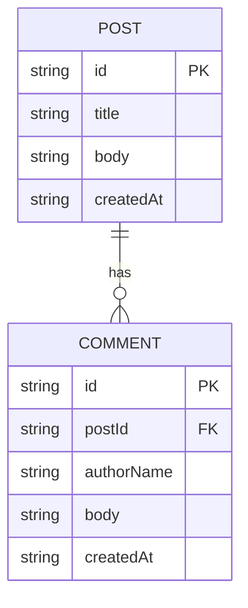

# Domain Model

The blog has two entities: posts the admin manages, and comments guests leave
on them.

- **Post**: title + body only, visible to guests as soon as the admin creates
it — no draft state.
- **Comment**: belongs to one post, carries the signed-in guest's display name
(`authorName`, taken from their identity) and body text. Comments cannot be
edited; the admin can delete one.

