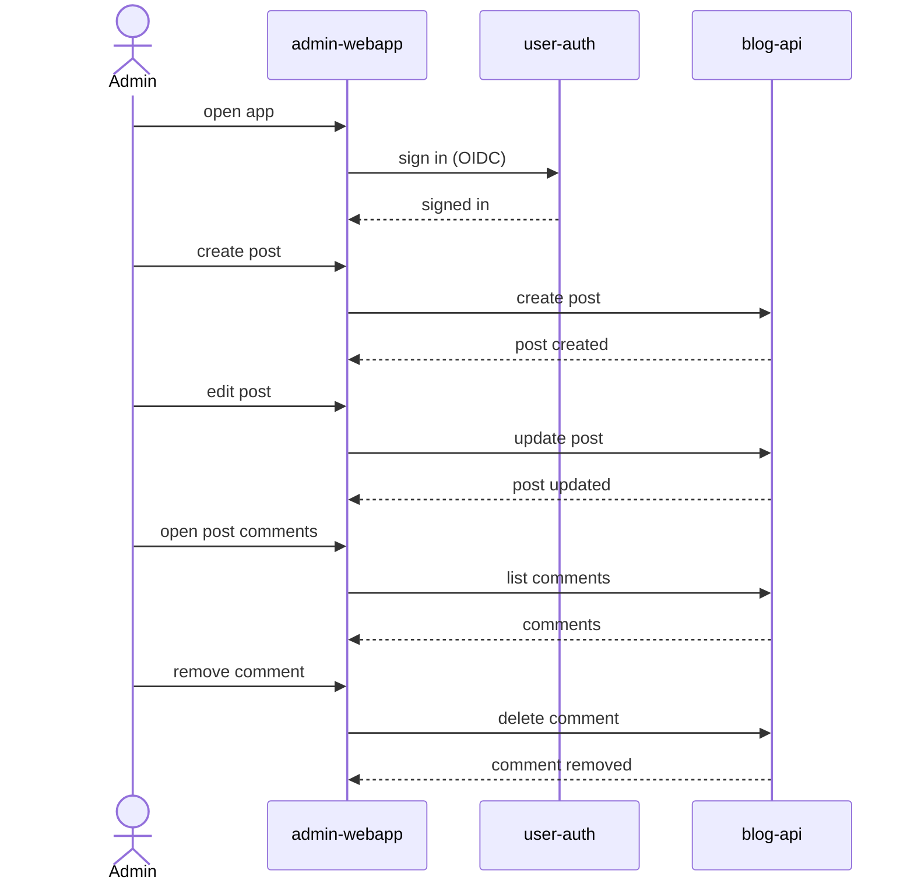

# Admin manages posts and moderates comments

The admin signs in, creates and edits posts, and removes a comment guests left.

```mermaid
sequenceDiagram
    actor Admin
    participant admin-webapp
    participant user-auth
    participant blog-api

    Admin->>admin-webapp: open app
    admin-webapp->>user-auth: sign in (OIDC)
    user-auth-->>admin-webapp: signed in
    Admin->>admin-webapp: create post
    admin-webapp->>blog-api: create post
    blog-api-->>admin-webapp: post created
    Admin->>admin-webapp: edit post
    admin-webapp->>blog-api: update post
    blog-api-->>admin-webapp: post updated
    Admin->>admin-webapp: open post comments
    admin-webapp->>blog-api: list comments
    blog-api-->>admin-webapp: comments
    Admin->>admin-webapp: remove comment
    admin-webapp->>blog-api: delete comment
    blog-api-->>admin-webapp: comment removed
```

