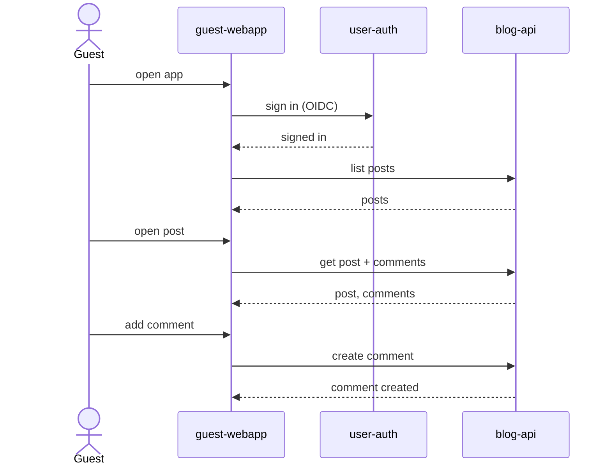

# Guest reads and comments on a post

A signed-in guest browses posts, reads one, and leaves a comment.

```mermaid
sequenceDiagram
    actor Guest
    participant guest-webapp
    participant user-auth
    participant blog-api

    Guest->>guest-webapp: open app
    guest-webapp->>user-auth: sign in (OIDC)
    user-auth-->>guest-webapp: signed in
    guest-webapp->>blog-api: list posts
    blog-api-->>guest-webapp: posts
    Guest->>guest-webapp: open post
    guest-webapp->>blog-api: get post + comments
    blog-api-->>guest-webapp: post, comments
    Guest->>guest-webapp: add comment
    guest-webapp->>blog-api: create comment
    blog-api-->>guest-webapp: comment created
```

